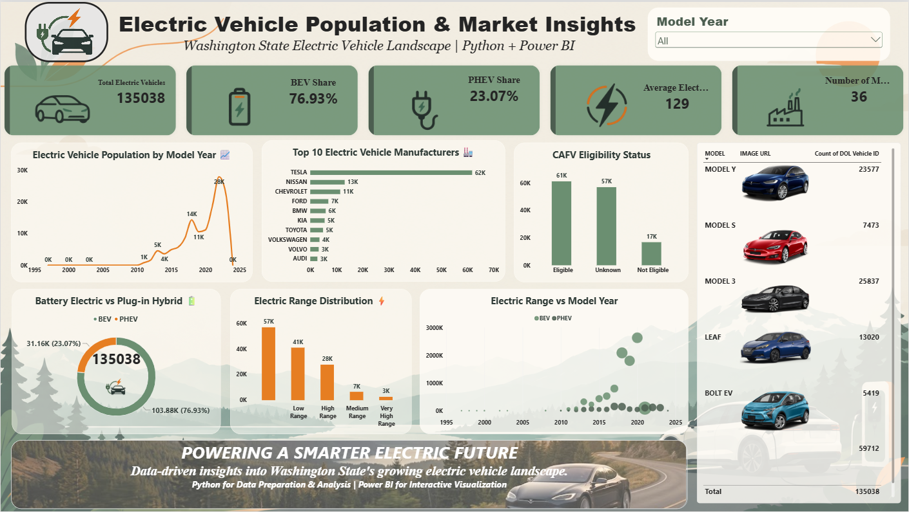

# Electric Vehicle Population & Market Insights

An interactive Power BI dashboard analyzing the electric vehicle landscape in Washington State using Python and Power BI.

## 📊 Project Overview

This project analyzes 135,038 electric vehicle records to understand patterns in EV adoption, manufacturers, vehicle types, electric range, and model years.

## 🛠️ Tools & Technologies

- Python
- Pandas
- Power BI
- Data Cleaning
- Data Analysis
- Data Visualization

## 🔍 Key Analysis

- Electric Vehicle Population by Model Year
- Top 10 EV Manufacturers
- BEV vs PHEV Distribution
- CAFV Eligibility Status
- Electric Range Distribution
- Electric Range vs Model Year
- Top EV Models

## 📈 Dashboard

The dashboard was designed in Power BI with a focus on interactive visualizations and a clean, professional layout.

## 🎓 Learning

This project was created as part of my self-learning journey in Power BI. I completed the **30 Days Power BI Micro Course by SkillCourse** and applied the concepts learned during the course to build this project.

## 📌 Project Outcome

This project helped me strengthen my skills in data preparation, analysis, visualization, and Power BI dashboard development.
